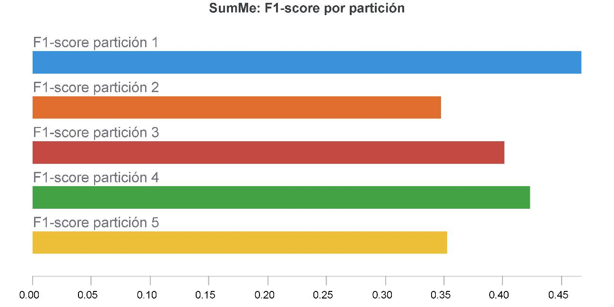
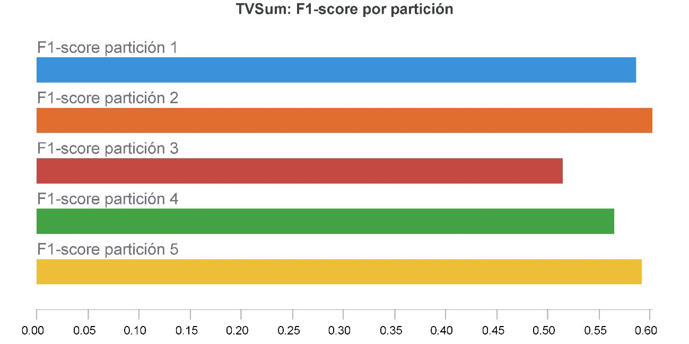
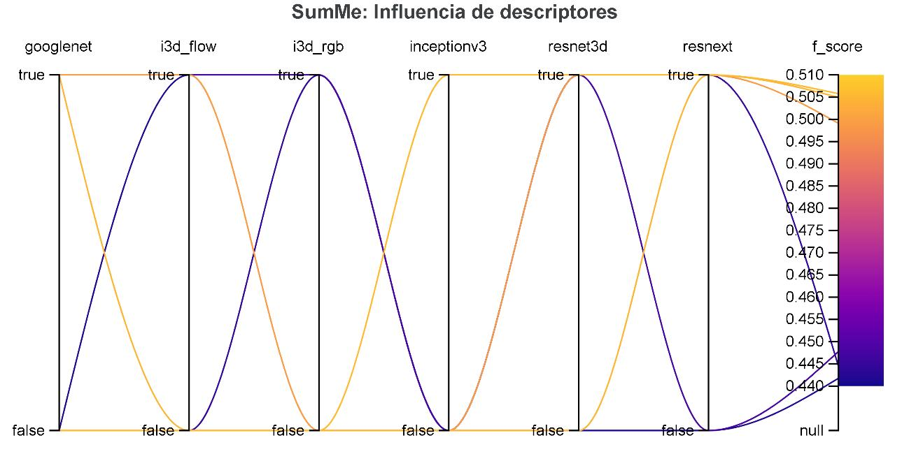
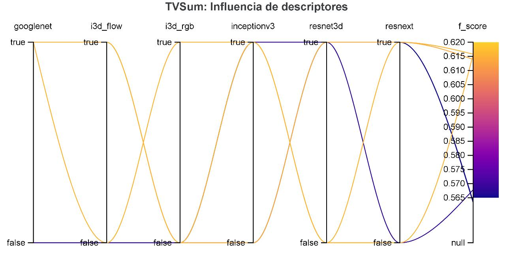
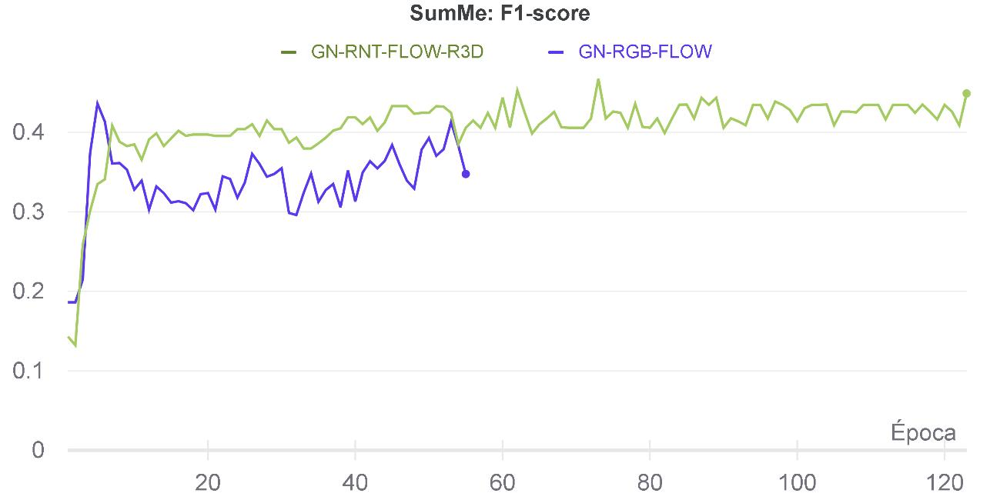
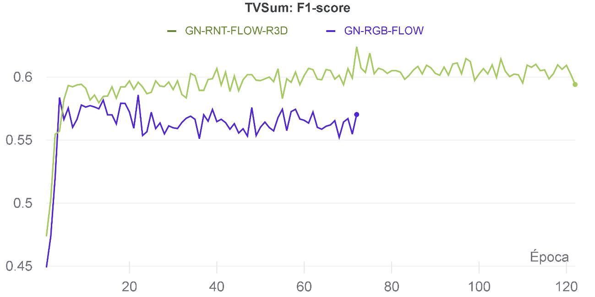

# <strong>Video Summarization of Sports Videos based on MSVA</strong>
Based on https://github.com/TIBHannover/MSVA

This repository contains a PyTorch implementation of MSVA model with different feature vectors. I compared GoogleNet, ResNext, InceptionV3, I3D RGB, I3D FLOW, and ResNet3D to see which one contributes more to the video summarization task. Additionaly, I propose a method to process different anotated set of videos. Finally, because there is no an official split, I demostrated that the metric highly depends on it.  

To get the datasets and weights used in this repository, log into your google account and run the code

1. `pip3 install gshell==5.5.2`
2. `gshell init` to log into your account

More about gshell: https://pypi.org/project/gshell/

## <strong>System requirements</strong>
* I strongly recomend Linux for performance and compatibility.
* Python 3.8.11 is recomended due to library versions.
* To install the libraries, I used PIP
* GPU is not mandatory, but it speeds up training time
* `N_CUDA` environment variable is defined to choose the GPU in case of having more than one

    ```bash
    pip3 install -r requirements.txt  # use pip in case your pip has python3
    ```
    
Note: in case doesnt work -> pip3 install torch==1.8.0+cu111 torchvision==0.9.0+cu111 torchaudio==0.8.0 -f https://download.pytorch.org/whl/torch_stable.html


## <strong>Pretrained models and transformations</strong>
In order to experiment with pretrained models, it is necessary to download [them](https://drive.google.com/drive/u/0/folders/1Yc-xzYw3yEJE3_64KgF2sfFdw_u8XZAc). It contains:
1. Pretrained MSVA models taken from [here](https://github.com/TIBHannover/MSVA/tree/master/model_weights): tvsum_random_non_overlap_0.6271.tar.pth and summe_random_non_overlap_0.5359.tar.pth
2. Pretrained FLOW and RGB imagenet models taken from [here](https://github.com/piergiaj/pytorch-i3d/tree/master/models): flow_imagenet.pt and rgb_imagenet.pt
3. Pretrained resnet 3D taken from [here](https://github.com/kenshohara/3D-ResNets-PyTorch): r3d101_KM_200ep.pth
4. Transformations to fuse all the feature vectors: transformations.pk 

```bash
./scripts/downloadPTModels.sh #remember to log into your google account
```

## <strong>Dataset</strong>

To download the raw dataset (SumMe, TVSum, VSumm, CoSum, and Visiocity), I used the gshell library. It can be downloaded from pip. Since it has 16GB I recommend using it. Run the following command to get the preprocessed dataset.

```bash
./scripts/downloadDataset.sh`
```

Manually, this is the [link](https://drive.google.com/uc?export=download&confirm=sSIJ&id=1IKqOTjC_ehscGbUfRlxRijPijIgrqakN)


To generate the h5 files which contain the processed dataset run the following code for each dataset

```bash
python3 generate_dataset.py --videospath <VIDEO_PATH> --groundtruthpath <GROUND_TRUTH_PATH> --dataset <DATASET> --pathweightsflow <PATH_WEIGHTS_FLOW> --pathweightsrgb <PATH_WEIGHTS_RGB> --pahtweightsr3d101KM <PATH_WEIGHTS_R3D>
```
* `VIDEO_PATH`: path where videos are located
* `GROUND_TRUTH_PATH`: path where ground truth annotations are located
* `DATASET`: dataset name -> summe, tvsum, youtube, ovp or cosum
* `PATH_WEIGHTS_FLOW`: path where weights flow are located
* `PATH_WEIGHTS_RGB`: path where weights rgb are located
* `PATH_WEIGHTS_R3D`: path where weights r3d101km are located

This [folder](https://drive.google.com/drive/u/0/folders/1cNm3uCaWlfCjIXWOPUF8P7E7nLrJ08N5) contains 9 datasets for video summarization, 5 generated by the generate_dataset.py code and the rest by previous works:

1. dataset_cosum_processed.h5
2. dataset_ovp_processed.h5
3. dataset_summe_processed.h5
4. dataset_tvsum_processed.h5
5. dataset_youtube_processed.h5
6. eccv16_dataset_ovp_google_pool5.h5
7. eccv16_dataset_summe_google_pool5.h5
8. eccv16_dataset_tvsum_google_pool5.h5
9. eccv16_dataset_youtube_google_pool5.h5

To download the processed datasets:
```bash
./scripts/downloadPDataset.sh
```

Each h5 file follows the same data structure:

key      | Description 
-------- | --------- 
features | 2D-array with shape (n_steps, 1024) contains feature vectors representing video frames. Each video frame can be represented by a feature vector (containing some semantic meanings), extracted by a pretrained convolutional neural network (e.g. GoogLeNet). It is used in traning, test and inference time. Trained for the image classification task.
features_rn | 2D-array with shape (n_steps, 2048) contains feature vectors representing video frames just like features key. In this case, extracted by ResNext 101 32x8d pretrained convolutional neural network. Trained for the image classification task.
features_iv3 | 2D-array with shape (n_steps, 2048) contains feature vectors representing video frames just like features key. In this case, extracted by Inception V3 pretrained convolutional neural network. Trained for the image classification task.
features_rgb | 2D-array with shape (n_steps * rate, 1024) contains feature vectors representing video frames just like features key. In this case, extracted by Two-Stream  Inflated  3D  ConvNets  (I3D) pretrained convolutional neural network (RGB features). Trained for the action recognition task.
features_flow | 2D-array with shape (n_steps * rate, 1024) contains feature vectors representing video frames just like features key. In this case, extracted by Two-Stream  Inflated  3D  ConvNets  (I3D) pretrained convolutional neural network (FLOW features). Trained for the action recognition task.
features_3D | 2D-array with shape (n_steps * rate, 2048) contains feature vectors representing video frames just like features key. In this case, extracted by ResNet3D pretrained convolutional neural network. Trained for the action recognition task.
gtscore | 1D-array with shape (n_steps), stores ground truth improtance score (used for training, e.g. regression loss) is the average of multiple importance scores (used by regression loss). It is used in training and test time.
user_summary | 2D-array with shape (num_users, n_frames), each row is a binary vector (used for test) contains multiple key-clips given by human annotators and we need to compare our machine summary with each one of the user summaries. It is used in test time.
change_points | 2D-array with shape (num_segments, 2), each row stores indices of a segment corresponds to shot transitions, which are obtained by temporal segmentation approaches that segment a video into disjoint shots num_segments is number of total segments a video is cut into. It is used in test time.
n_frame_per_seg | 1D-array with shape (num_segments), indicates number of frames in each segment. It is used in test time.
n_frames | number of frames in original video. It is used in test time.
fps | frames per second of the original video
picks | positions of subsampled frames in original video is an array storing the position information of subsampled video frames. We do not process each video frame since adjacent frames are very similar. We can subsample a video with 2 frame per second or 1 frame per second, which will result in less frames but they are informative. It is useful when we want to interpolate the subsampled frames into the original video (say you have obtained importance scores for subsampled frames and you want to get the scores for the entire video can indicate which frames are scored and the scores of surrounding frames can be filled with these frames). It is used in test time.
n_steps | number of subsampled frames.
gtsummary | 1D-array with shape (n_steps), ground truth summary provided by user (used for training, e.g. maximum likelihood) is a binary vector indicating indices of keyframes, and is provided by original datasets as well (this label can be used for maximum likelihood loss).
video_name | original video name

Note: Not all files from previous works have the same structure

## <strong>Training the network</strong>
I used Weights & Biases to track the different experiments I did (different features and splits). 
1. Change or choose one of the `config.json` located in the folder named configs/.
2. Run `wandb login 17d2772d85cbda79162bd975e45fdfbf3bb18911` to use wandb.
3. Run the following code for training without wandb tracking.
```bash
python3 train_cross_val.py --params <CONFIGFILE_PATH>
```
    * `CONFIGFILE_PATH`: path of the config.json file (see Hyperparameters Configuration) 

You can see the Weights & Biases report here: https://wandb.ai/stevramos/sports_video_summarization

### <strong>Configuration flags for the training script</strong>
Other flags for the train_cross_val.py script
1. `--no_wandb`: do not use weights and biases (optional, used by default)
2. `--pretrained_model`: path of pretrained model (optional)
3. Using wandb without sweep
    * `--wandb`: use weights and biases (required for using wandb)
    * `--run_name`: name of the execution to save in wandb (optional)
    * `--run_notes`: notes of the execution to save in wandb (optional)
2. Using sweep
    * `--use_sweep`: to use sweep (required for using sweep, flag wandb is true by default)

### <strong>Hyperparameters Configuration</strong> 
I used the same hyperparameters as the original code, but with different uses of feature and size vectors. You can modify the following variables in config json files located in the configs folder:

* To set or clear the using of certain feature change the value to true or false in the keys `googlenet`, `resnext`, `inceptionv3`, `i3d_rgb`, `i3d_flow`, `resnet3d`
* `feature_len`: 1024 (in case of normalizing the vectors. Allowed for all the pretrained models) or 2048(to use the original vectors. It can't be use in googlenet, i3d_rgb and i3d_flow)
* `type_dataset`: the dataset in which test the model(tvsum or summe)
* `type_setting`: canonical, aug(augmented), transfer, non_overlap_*_[aug]

For this purpose, the splits are given by different previous works (see the splits folder)

### <strong>Cross validation</strong>

According prior works, I used cross validation to evaluate the performance.

#### <strong>Baseline model</strong>
I trained the MSVA model with original features
* F1 Score SumMe: <strong>0.476</strong>
* F1 Score TVSum: <strong>0.594</strong>
<div align="center">
  
  
</div>

#### <strong>Grid Search</strong>
I trained 64 times the model with different features extracted before to see which one contributes more. Coincidentally, in both sets of videos one of the combinations with the best performance is the use of descriptors GoogleNet, ResNext, I3D FLOW and ResNet3D.

To train the model, run the following code:


<div align="center">
  
  
</div>

#### <strong>GoogleNet, ResNext, I3D FLOW and ResNet3D VS GoogleNet, I3D RGB e I3D FLOW</strong>
It can be observed that the model with the new descriptors, in both cases SumMe and TVSum, exceeds the baseline model. 

Note: The comparison was done in one split in the images shown below.

<div align="center">
  
  
</div>

Comparison of F1-Score with the baseline model under Canonical, Augmented and Transfer settings.

Model                      | SumMe<br/>Canonical| SumMe<br/>Augmented| SumMe<br/>Transfer |TVSum<br/>Canonical| TVSum<br/>Augmented| TVSum<br/>Transfer   
--------                   |---  |--------|--------|--------|--------|--------                 
Baseline model             | 0.476 | -   | - | 0.594 | - | -
Model with new descriptors | <strong>0.499</strong> | 0.48 | 0.43   | <strong>0.613</strong> | 0.62 | 0.57
        
## <strong>Acknowledgments</strong>
I would like to thank the following repositories for releasing the evaluation code / data / splits / metrics that made my research possible.

* [MSVA](https://github.com/TIBHannover/MSVA)
* [PyTorch-I3D](https://github.com/piergiaj/pytorch-i3d)
* [VASNet](https://github.com/ok1zjf/VASNet)
* [DSNet](https://github.com/li-plus/DSNet)
* [VSUMM reinforce](https://github.com/SinDongHwan/pytorch-vsumm-reinforce)
* [ResNet3D](https://github.com/kenshohara/3D-ResNets-PyTorch)
 


